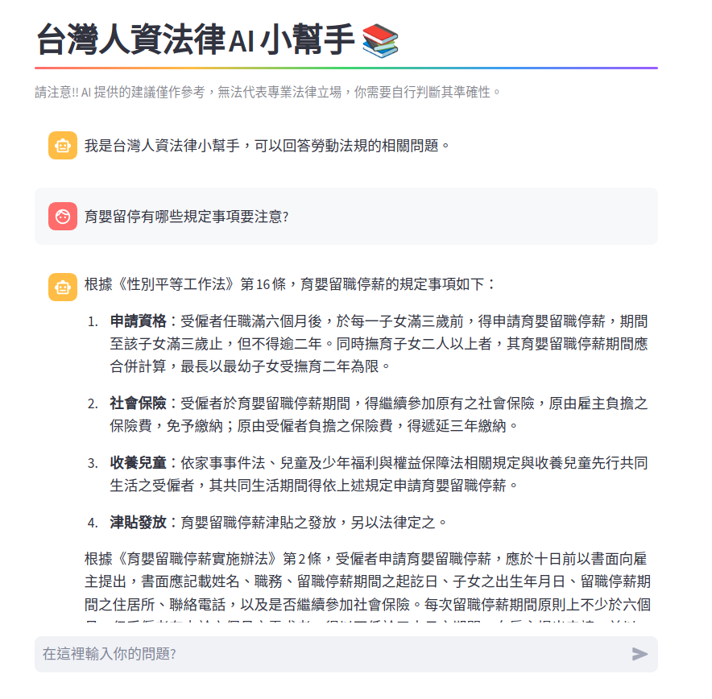
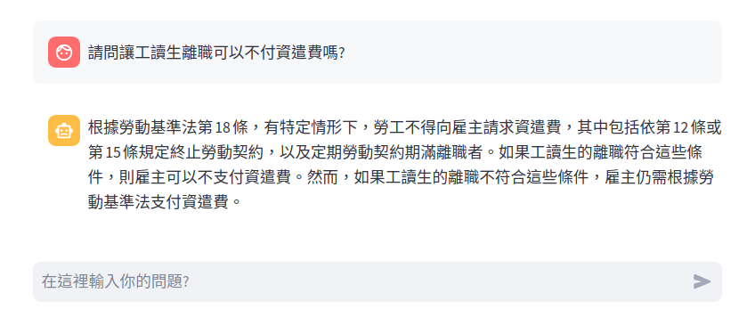
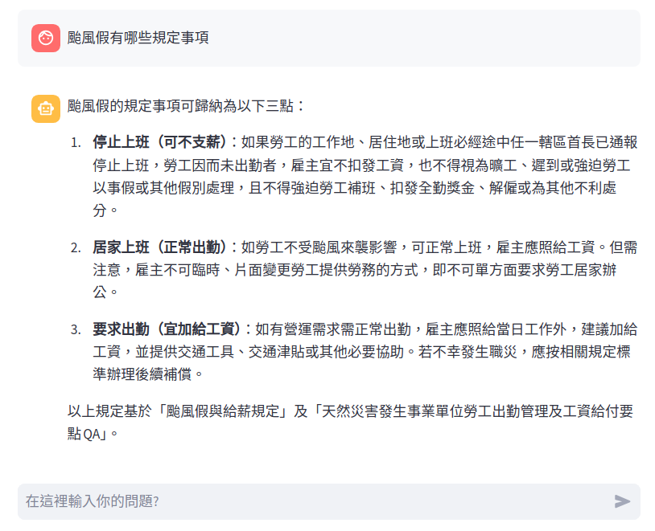
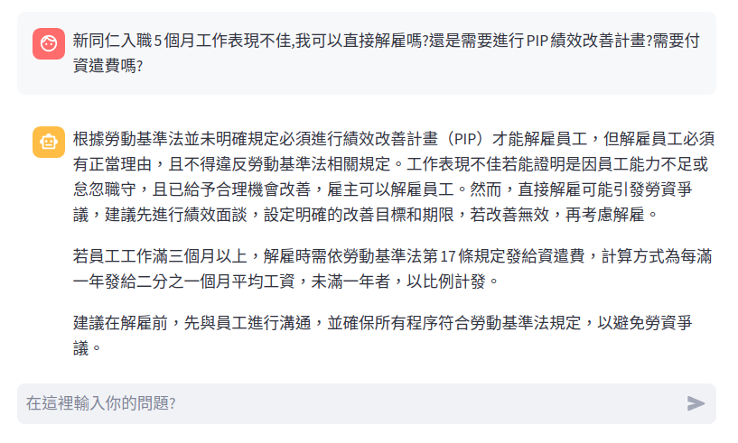
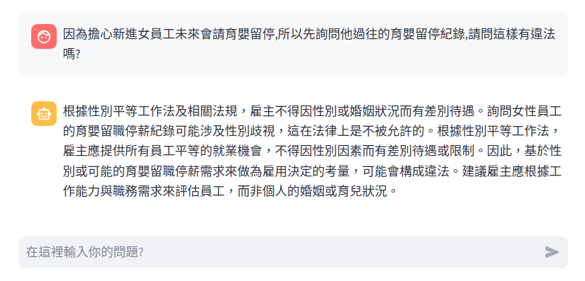

## 台灣人資法律AI小幫手

TW-HRGPT - 台灣人資法律小幫手



### 緣由

運用生成式 AI 的前沿技術，讓企業基於安全性與隱私性條件下，將其應用在內部知識庫的實際範例。

目的：AI 可以基於所提供的各項勞動法規檔案，與公司規定章程的內容，回答員工的相關提問。

說明：企業不適合開放 ChatGPT 給員工使用，除了安全性考量以外，還有就是資訊準確性與可控性；任何外部的大語言模型，例如 GPT-4o、Claude 3.5 Sonnet、 Llama 3.1等等，這些都是用了開放的資料集作訓練，所以對於廣泛型的問題可以提供解答；然而對於企業的各種特定知識，這類大語言模型並無法直接使用，還必須透過微調模型或 RAG 技術，讓大語言模型可以基於所提供的企業知識，來生成有效且較為準確的回答。

本例使用的主要以 RAG 技術為主。有了大語言模型對於文字的理解能力，加上 RAG 技術可以讓 AI 先檢索企業的內部知識庫，最後在綜合生成最佳的答案。

小幫手 AI 不僅可以理解提問的文字內容，在回答前還會先去檢索內部的法規知識庫後再做回答。

### 開發環境

+ LangChain
+ Streamli
+ LLM Model
+ Embedding Model

實現 RAG 應用，主要的核心開發框架是用 LangChain，Web-UI 框架是用 Streamli。

LLM Model 可用雲端或地端的各種不同模型。 

### Deployment

a. 前往 [全國法規資料庫](https://law.moj.gov.tw/) 下載需要的法規檔案，格式選 RTF

b. 下載本專案檔案

```bash
git clone https://github.com/a-lang/tw-hrgpt
cd tw-hrgpt
```

c. 使用專案的 `preprocessing.sh` 將所有 .rtf 檔轉換成 .md

```bash
./preprocessing.sh -h
```

d. 將 .md 檔案複製到專案目錄底下的 docs 目錄

e. 建立 Python 虛擬環境並安裝需要的模組

```bash
python -m venv .venv
source .venv/bin/activate
pip install pip --upgrade
pip -r install requirements.txt
```

f. 建立向量知識庫

```bash
python ingest.py
```

g. 啟動應用程式

```bash
streamlit run st_ui.py
```


### Advanced RAG

應用 RAG 在實務上，如果只是基礎的 RAG 設計，經常會遇到檢索結果不正確、或者是時好，時不好的不穩定現象，最後導致生成的答案不如預期。Advanced RAG 是根據 RAG 流程的不同階段，分別採行對應的不同優化手段。

#### - Document Loader

建立本地知識庫時，來源文件的格式與內容型式，決定了整個專案開發的難易程度。

內容型式

+ 純文字：容易，本例知識庫就是純文字
+ 文字 + 表格 + 圖片：難，表格與圖片都需要許多額外的預處理程序

檔案格式

+ TEXT：建議，文字段落要完整，如有無意義的符號，應該要事先清理
+ Markdown：建議，文字段落要完整，如有無意義的符號，應該要事先清理
+ PDF：不建議，可以使用，不過因為 PDF 有分頁與行寬限制的特性，這個會截斷許多文字段落，以致部份文字的語意會有不完整的情形。真的要用這種格式，需做好文字預處理，減少重要資訊被截斷的機率

#### - Splitting/Chunking

切割文件時可以用到幾個技巧：

+ 文字長度：依照文字的編排選擇適合的長度，盡可能地保留文字段落的完整性
+ 分隔器：中文文件可以加上句點，與特定文字段落，例如本範例第 X 章、第 X 條
+ 語意切割：使用 LLM 語意理解的特性，對文件作切割。此法看起來應該是文件切割後保持完整語意的最好方法，然而，對本例的中文文件內容，卻完全不起作用

#### - Embedding & Rerankng Model

+ 這兩個模型要使用適合的支援語言，如果知識庫是中文，模型也要使用有支援中文語系的，不然檢索結果會差強人意。

+ 基本上這是兩個不同的模型，選用時要多試試，有時後排行榜的結果不一定符合你的專案特性。

#### - Retrieval

1. Multi-Query 檢索：優化使用者的問題。以 LLM 生成多個（3-5）類似的不同提問建議，然後分別再以建議的多道問題對向量庫進行相似度檢索。此法對於那些含糊不清的提問，可以改善檢索的結果。

2. Parent-Documnet 檢索：父文件檢索。將一份文件切成不同小塊的文字，嵌入向量庫以外，在將每個小文字區塊與原始文件的關聯性，儲存至另一個父文件檔案。檢索問題時，先對向量庫裡的小區塊進行相似度檢索，然後找出原始父文件的內容，作為上下文的生成依據。相似度檢索要提高檢索精確度，嵌入時文字分塊要小；不過，缺點是過小的文字塊，無法產生對於問題完整理解的上下文。此法主要就是改善過小文字塊的缺點。
3. Rerank 檢索：重排序演算檢索。使用 Rerank 模型對向量庫相似度檢索的結果，進行語意排序並篩選出最佳的結果。不同的 Rerank 模型搭配不同的嵌入模型，都會有不的檢索結果。兩者關係沒有一定的規則或限制，準確度要以實際套用的結果為主。

#### - LLM Model

LLM Model 的選用決定了 RAG 最終輸出的品質結果，包括文字輸出排版的美醜、上下文內容的語意理解程度與生成文字的速度延遲。

+ Google-1.5-flash: 有最佳的語意理解與輸出結果，且個人開發時，可以免費使用 API。

+ Groq llama 3/3.1: 語意理解可以接受；文字輸出排版稍顯單調。
+ TAIDE/Taiwan LLM/Breeze: 這些針對繁體中文優化過的模型，對於中文文件內容的理解，會比國外的模型還要好。
+ 模型參數: 盡可能使用 70B 以上參數規格的模型。使用較小參數的模型，對於問題的理解能力與生成答案內容的品質都會比較差。

### Screenshots








